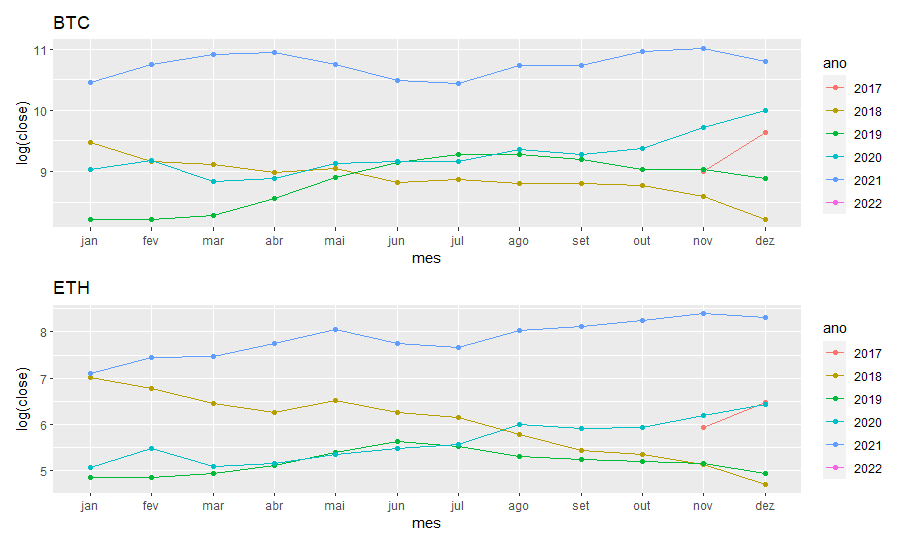
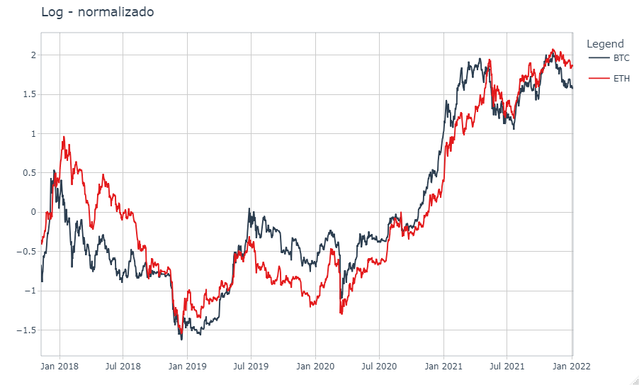
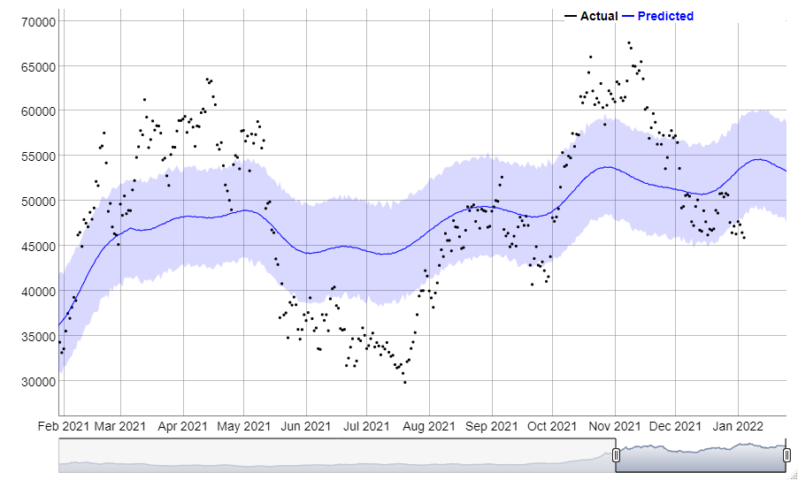
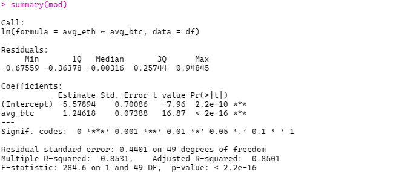

# Fazer previsão do Bitcoin com base no ptk `prophet`

A ideia do projeto é fazer um analise dos dados de fechamento das duas principais clipto moedas

## Fechamento médio por mes e ano

## Relacão entre o BTC e ETH
> Apliqui a `N(1,0)` e `log1p()`

ps. *No ultimo mes, vemos um descolamento entres a moedas*

## Estimativas para o proximos dias do BTC e ETH

* Projeção com base no pacote `prophet`
> Fazer tune dos parametros

|ds         | trend_btc| trend_eth|
|:----------|---------:|---------:|
|2022-01-02 |  52818.65|  4481.103|
|2022-01-03 |  52845.45|  4490.496|
|2022-01-04 |  52872.24|  4499.888|
|2022-01-05 |  52899.04|  4509.281|
|2022-01-06 |  52925.84|  4518.674|
|2022-01-07 |  52952.63|  4528.067|
|2022-01-08 |  52979.43|  4537.460|
|2022-01-09 |  53006.22|  4546.853|
|2022-01-10 |  53033.02|  4556.246|
|2022-01-11 |  53059.82|  4565.639|
|2022-01-12 |  53086.61|  4575.032|
|2022-01-13 |  53113.41|  4584.425|
|2022-01-14 |  53140.20|  4593.818|
|2022-01-15 |  53167.00|  4603.211|
|2022-01-16 |  53193.80|  4612.604|
|2022-01-17 |  53220.59|  4621.997|
|2022-01-18 |  53247.39|  4631.389|
|2022-01-19 |  53274.19|  4640.782|
|2022-01-20 |  53300.98|  4650.175|
|2022-01-21 |  53327.78|  4659.568|
|2022-01-22 |  53354.57|  4668.961|
|2022-01-23 |  53381.37|  4678.354|
|2022-01-24 |  53408.17|  4687.747|
|2022-01-25 |  53434.96|  4697.140|
|2022-01-26 |  53461.76|  4706.533|
|2022-01-27 |  53488.55|  4715.926|
|2022-01-28 |  53515.35|  4725.319|
|2022-01-29 |  53542.15|  4734.712|
|2022-01-30 |  53568.94|  4744.105|
|2022-01-31 |  53595.74|  4753.497|
|2022-02-01 |  53622.53|  4762.890|
|2022-02-02 |  53649.33|  4772.283|
|2022-02-03 |  53676.13|  4781.676|
|2022-02-04 |  53702.92|  4791.069|

## Ajuste com regressão linear

* A ideia é tentar estimar o valor médio das clipto moedas por mes, com base em outras variaveis macro economicas 

